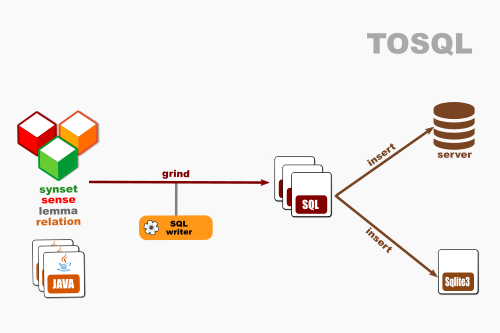

# OEWN model-to-SQL

This writes a model to SQL format.

Project [tosql](https://github.com/x-englishwordnet/tosql)

## Dataflow

## Maven Central

		<groupId>io.github.x-englishwordnet</groupId>
		<artifactId>tosql</artifactId>
		<version>1.0.0-SNAPSHOT</version>
